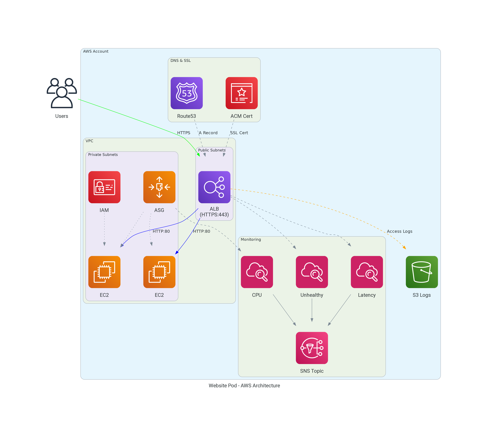

# Architecture

This document explains how the terraform-aws-website-pod module works and the resources it creates.

## High-Level Architecture



## Resource Overview

### Application Load Balancer (ALB)

The module creates an internet-facing Application Load Balancer that:

- Listens on port 443 (HTTPS) with the ACM certificate
- Listens on port 80 (HTTP) and redirects to HTTPS
- Performs health checks against backend instances
- Optionally logs access requests to S3

**Key configurations:**
- `userdata` - A cloud-init script that provisions the EC2 instance and starts your HTTP server
- `subnets` - Subnet IDs where the ALB is deployed (typically public subnets for internet-facing applications)
- `backend_subnets` - Subnet IDs where EC2 instances run (typically private subnets for security)
- `zone_id` and `dns_a_records` - Route53 hosted zone and DNS names that will resolve to the ALB
- `alb_healthcheck_path` - URL path the ALB uses to verify backend instances are healthy

### Auto Scaling Group (ASG)

The ASG manages EC2 instances and:

- Maintains minimum/maximum instance counts
- Scales based on CPU utilization (target tracking)
- Supports instance refresh for zero-downtime deployments
- Optionally uses spot instances for cost savings

**Key configurations:**
- `asg_min_size` / `asg_max_size` - Instance count limits
- `autoscaling_target_cpu_load` - Target CPU for scaling (default: 60%)
- `on_demand_base_capacity` - Minimum on-demand instances (rest are spot)
- `max_instance_lifetime_days` - Force instance rotation

### ACM Certificate

The module automatically:

1. Requests an ACM certificate for your domain
2. Creates DNS validation records in Route53
3. Waits for certificate validation
4. Attaches the certificate to the ALB

The certificate covers all DNS names specified in `dns_a_records`.

### Security Groups

Two security groups are created:

#### ALB Security Group

| Direction | Port | Source | Purpose |
|-----------|------|--------|---------|
| Ingress | 443 | `alb_ingress_cidr_blocks` | HTTPS traffic |
| Ingress | 80 | `alb_ingress_cidr_blocks` | HTTP (redirects to HTTPS) |
| Ingress | ICMP | 0.0.0.0/0 | Ping/diagnostics |
| Egress | All | 0.0.0.0/0 | Outbound traffic |

#### Backend Security Group

| Direction | Port | Source | Purpose |
|-----------|------|--------|---------|
| Ingress | `target_group_port` | ALB SG | Application traffic |
| Ingress | `target_group_port` | ALB SG | Health checks |
| Ingress | 22 | VPC CIDR | SSH from VPC |
| Ingress | 22 | `ssh_cidr_block` | SSH from allowed ranges |
| Ingress | ICMP | 0.0.0.0/0 | Ping/diagnostics |
| Egress | All | 0.0.0.0/0 | Outbound traffic |

### DNS Records

The module creates in Route53:

1. **A Records** - Alias records pointing to the ALB for each name in `dns_a_records`
2. **CAA Records** - Certificate Authority Authorization records restricting which CAs can issue certificates
3. **Certificate Validation Records** - CNAME records for ACM DNS validation

### CloudWatch Alarms

When `alarm_emails` is configured, the module creates:

| Alarm | Metric | Purpose |
|-------|--------|---------|
| Unhealthy Host Count | `UnHealthyHostCount` | Alert when instances fail health checks |
| Target Response Time | `TargetResponseTime` | Alert on high latency |
| Low Success Rate | HTTP 5xx errors | Alert when error rate exceeds threshold |
| CPU Utilization | `CPUUtilization` | Alert when autoscaling can't keep up |

## Request Flow

1. User requests `https://example.com`
2. DNS resolves to ALB IP address
3. ALB terminates SSL using ACM certificate
4. ALB routes request to healthy backend instance
5. If stickiness enabled, subsequent requests go to same instance
6. Backend processes request and returns response
7. ALB forwards response to user

## Scaling Behavior

The Auto Scaling Group uses target tracking to maintain CPU utilization:

1. **CPU < Target (60%)**: System is stable, no scaling action
2. **CPU > Target (60%)**: ASG launches new instances (takes ~5-10 minutes)
3. **CPU > Alarm Threshold (90%)**: If CPU stays high after scaling, alarm triggers

**Default thresholds:**
- Target CPU: 60% (ASG adds instances)
- Alarm threshold: 90% (alerts that scaling isn't keeping up)

## High Availability

The module achieves high availability through:

1. **Multi-AZ deployment** - ALB and instances span multiple availability zones
2. **Health checks** - Unhealthy instances are replaced automatically
3. **Instance refresh** - Zero-downtime updates via rolling deployments
4. **Lifecycle hooks** - Graceful instance launch and termination

## Cost Optimization

### Spot Instances

Enable spot instances to reduce costs:

```hcl
on_demand_base_capacity = 1  # Keep 1 on-demand, rest are spot
```

This maintains availability with at least one on-demand instance while using spot for additional capacity.

### Right-sizing

- Use `instance_type` appropriate for your workload
- Set `asg_max_size` to limit maximum spend
- Enable ALB access logging to analyze traffic patterns